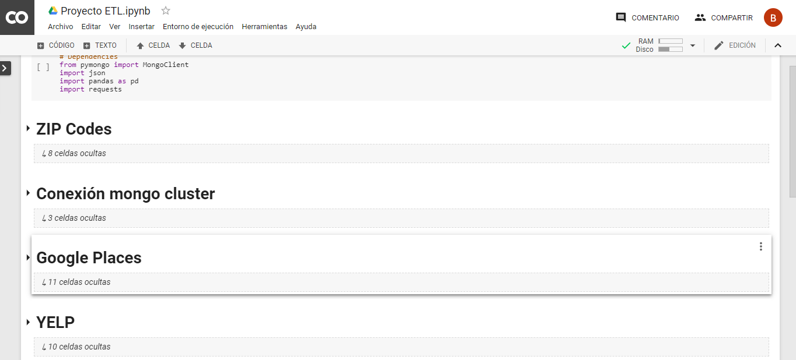

# ETL Project

## Background

- Our company is conducting a research about __Gentrification__ in Mexico City. 

- Our data analysts asked us to assemble some initial datasets. They want to replicate other countries experiences about the demonstration that data from digital platforms have the potential to improve the understanding of gentrification.
 * [Measuring Gentrification: Using Yelp Data to Quantify Neighborhood Change](http://www.nber.org/papers/w24952)
 * [Predicting gentrification through social networking data] (https://www.cam.ac.uk/research/news/predicting-gentrification-through-social-networking-data)

 
- We Extracted, Transformed and Loaded data sources and created requests to Google Places and Yelp. Then we stored the information in Mongo.

## Results

- The notebook with the web scraping to Yelp.com can be found [here] (/Notebook). 

- The rest of the code was included in a [Colaboratory notebook] (https://colab.research.google.com/drive/1ICm2k1gXNu64Oij10fdtf1_ejK5mRDR2#scrollTo=o2-WzowQQU1i)

   